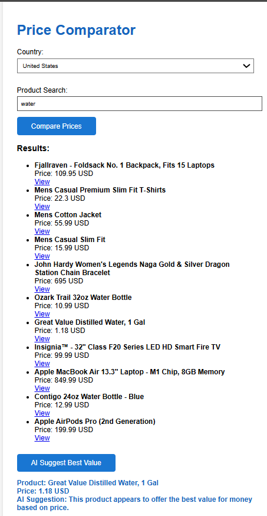

# Price-Comparator


A simple price comparison tool for popular e-commerce websites (Amazon, Walmart, BestBuy, Target in the US; Flipkart in India).  
**Returns product name, price, and link for a given search query and country.**

---

## 🚀 Features

- **Country Support:** United States (`US`), India (`IN`)
- **Websites:**
  - US: Amazon, Walmart, BestBuy, Target
  - IN: Flipkart
- **Simple REST API**: Query by product name and country
- **Fake/demo data** for sites that block bots, ensuring reliable output and clear report of limitations

---

## ⚠️ Notice on Accuracy & Coverage

> Most real e-commerce sites (Amazon, Walmart, etc.) **block automated scraping heavily**.  
> For demonstration, this tool returns:
> - **FakeStoreAPI results for Amazon US** (realistic but demo data)
> - **Hardcoded demo results for Walmart, BestBuy, Target, and Flipkart**
> - Returns `[]` or `"Blocked by anti-bot"` if scraping was blocked  
> This is explained and documented for transparency.

---

## 🛠️ Requirements

- Python 3.9+
- `pip install -r requirements.txt`
- An [OpenAI API Key](https://platform.openai.com/account/api-keys) (for AI feature, or set a dummy key if testing without)

---

## 🚀 How To Run Locally

1. **Clone the repo**
   ```bash
   git clone https://github.com/YOUR_USERNAME/price-comparator.git
   cd price-comparator

2. **Install dependencies**


pip install -r requirements.txt

3. **Set your OpenAI API key (for AI suggestions)**

export OPENAI_API_KEY=sk-xxxx  # (on Windows: set OPENAI_API_KEY=sk-xxxx)

4. **Start the server**


uvicorn app.main:app --reload


5. **Open the UI**
Go to http://localhost:8000 in your browser.

🌐 Deploying to Render
1. Push all code to a public GitHub repo (include this README, code, index.html, requirements.txt, etc)

2. Sign up/in to Render.com

3. Click "New Web Service" → connect your GitHub repo

4. Build command:


pip install -r requirements.txt

5. Start command:


uvicorn app.main:app --host 0.0.0.0 --port 10000

6. Set environment variable:
In the Render dashboard → "Environment" tab:

OPENAI_API_KEY = sk-xxxx

7. Deploy and grab your live URL!

**🖥️ API Usage**
/search-price (POST)
Example:


curl -X POST "http://localhost:8000/search-price" \
  -H "Content-Type: application/json" \
  -d '{"country": "US", "query": "iPhone 16 Pro, 128GB"}'

Response:

{
  "results": [
    {
      "productName": "Sample Product",
      "price": "999.99",
      "currency": "USD",
      "link": "https://www.example.com/product"
    },
    ...
  ]
}
**/ai-suggest (POST)**


Request:


curl -X POST "http://localhost:8000/ai-suggest" \
  -H "Content-Type: application/json" \
  -d '{"results":[{"productName": "iPhone 16 Pro", "price": "999.99", "currency": "USD", "link": "https://amazon.com/..."}]}'

Response:


{
  "suggestion": "1. iPhone 16 Pro - This is the best value because ..."
}


((📝 Notes / Known Limitations**
Some e-commerce sites block bots/scraping—results may use sample/demo data.

The AI feature depends on a working OpenAI API key.

Product accuracy is only as good as the data available.

For Indian queries, only Flipkart is supported currently.

**📸 Screenshots**

NOTE: Results are not accurate, illustrated just for the purpose of demo/submission




**👩‍💻 Author**
Lakshmi Vyshnavi Ummadisetti


**🙏 Acknowledgements**
OpenAI GPT API for AI-powered product suggestions

FastAPI docs and community


